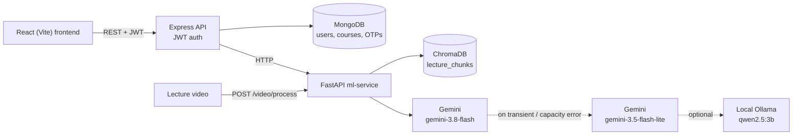

# VidyAstra AI

An AI academic assistant for NIT Jalandhar students, built on the lectures they actually attend.

## Overview

Lecture videos are turned into searchable course material:

1. **Transcription:** audio is extracted with ffmpeg and transcribed with [faster-whisper](https://github.com/SYSTRAN/faster-whisper).
2. **Slide text:** key frames are picked with OpenCV scene detection and their text is read with PaddleOCR.
3. **Indexing:** transcript and slide text are fused, split into overlapping chunks, embedded with `BAAI/bge-small-en-v1.5` and stored in ChromaDB.
4. **Grounded generation:** the student-facing tools retrieve the relevant chunks and pass them to an LLM:
   - **AI Tutor:** answers questions in chat from lecture content.
   - **AI Quiz:** multiple-choice quiz on a topic (1–10 questions, easy/medium/hard).
   - **AI Notes:** Markdown revision notes on a topic.

Every answer returns the lecture sources it was built from, and the UI shows them.

## Architecture



| Service | Folder | Default port |
|---|---|---|
| Frontend (React 19, Vite, Tailwind) | `frontend/` | 5173 |
| API (Express 5, Mongoose) | `backend/` | 5000 |
| ML service (FastAPI) | `ml-service/` | 8000 |

## Key design decisions

- **Provider-agnostic LLM layer** (`ml-service/services/llm.py`): one fallback chain (primary Gemini model, then the fallback model on transient or capacity errors, then optional local Ollama). When every attempt fails, the API returns a 502 that names each provider, model, status and error instead of a generic message.
- **Relevance cut-off** (`RELEVANCE_MAX_DISTANCE=0.70`): measured with `scripts/measure_relevance.py`. On-topic queries matched at distance 0.52–0.58 and off-topic ones at 0.79 or more. Off-topic quiz and notes requests get a clear 404 ("No indexed lecture covers 'X' yet.") instead of hallucinated content. The tutor tells the student the lectures don't cover the question and returns no sources.
- **Schema-validated JSON** for quiz and notes: Gemini JSON mode (Ollama `format=json`) constrained to a pydantic schema, validated, and retried once on invalid output.
- **Idempotent re-indexing:** indexing a lecture first deletes its old chunks. `scripts/index_existing_lectures.py` skips near-empty transcripts and detects duplicate lectures (re-uploads of the same video) by text similarity.
- **Model warm-up at startup:** the embedding model and Chroma collection load in a background thread, so `/health` responds immediately and the first request doesn't time out.
- **Auth hardening:**
  - JWTs are pinned to HS256 and carry a token version, so a password reset revokes older tokens.
  - The password-reset token is single-use and expires after 10 minutes.
  - Passwords are hashed with scrypt.
  - Register only accepts the `student` and `faculty` roles.
  - Profile update only accepts allowlisted fields.
  - Auth errors are uniform, so they don't reveal whether an account exists.
  - The server refuses to start with a missing, short or placeholder `JWT_SECRET`.

## Setup

### Prerequisites

- Node.js 22+
- Python 3.13 (the version `ml-service/.venv` was built with)
- MongoDB (local or Atlas)
- ffmpeg (only needed to process new videos)
- A Gemini API key. [Ollama](https://ollama.com) with `qwen2.5:3b` is optional, as a local fallback.

### ML service

```bash
cd ml-service
python -m venv .venv
.venv\Scripts\activate            # Windows; on macOS/Linux: source .venv/bin/activate
pip install -r requirements.txt
cp .env.example .env
```

Variables in `ml-service/.env.example`:

- **LLM:** `LLM_PROVIDER`, `GEMINI_API_KEY`, `GEMINI_MODEL`, `GEMINI_FALLBACK_MODEL`, `LOCAL_LLM_FALLBACK`, `OLLAMA_URL`, `OLLAMA_MODEL`, `LLM_TIMEOUT_SECONDS`
- **Pipeline:** `WHISPER_MODEL_SIZE`, `EMBEDDING_MODEL_NAME`, `HF_HUB_OFFLINE`, `FFMPEG_PATH`, `SCENE_SIMILARITY_THRESHOLD`, `OCR_CONFIDENCE_THRESHOLD`, `CHUNK_SIZE`, `CHUNK_OVERLAP`, `RELEVANCE_MAX_DISTANCE`

`FFMPEG_PATH` is the full path to the ffmpeg executable. Leave it empty to use `ffmpeg` from your `PATH`.

`HF_HUB_OFFLINE` can be set in `.env` or in the shell. `config.py` exports it to the environment before any HuggingFace library is imported. Turn it on only after the models are cached locally.

### Backend

```bash
cd backend
npm install
cp .env.example .env
```

Variables in `backend/.env.example`: `MONGO_URI`, `PORT`, `JWT_SECRET` (at least 32 random characters), `JWT_EXPIRES_IN`, `ML_SERVICE_URL`, `ML_TIMEOUT_MS`, `EMAIL`, `EMAIL_PASSWORD` (SMTP for OTP mails), `RECAPTCHA_SECRET_KEY`.

### Frontend

```bash
cd frontend
npm install
cp .env.example .env
```

Variables in `frontend/.env.example`: `VITE_API_BASE_URL`.

### Indexing lectures

New videos are processed by the ML service at `POST /video/process` (try it from `http://localhost:8000/docs`). The pipeline writes its intermediate output to `ml-service/storage/` and indexes the result.

To (re)build the index from lectures that are already processed (`storage/fusion/*_fusion.json`), run this from `ml-service/`:

```bash
python scripts/index_existing_lectures.py
python scripts/measure_relevance.py        # optional: re-check the relevance cut-off
```

### Run

In three terminals:

```bash
cd ml-service && python app.py      # http://localhost:8000  (wait for "warm-up complete in Xs")
cd backend && npm run dev           # http://localhost:5000
cd frontend && npm run dev          # http://localhost:5173
```

**Networks with HTTPS inspection** (antivirus or corporate proxies): the Python side uses [truststore](https://pypi.org/project/truststore/), so it trusts the OS certificate store. For Node, start the backend with `NODE_OPTIONS=--use-system-ca`. Don't disable TLS verification.

## API overview

All routes except register, login and the OTP/reset flow need `Authorization: Bearer <token>`.

| Method | Endpoint | Purpose |
|---|---|---|
| POST | `/api/auth/register` | Create account (`name`, `email`, `password` ≥ 8 chars, `role`: student or faculty) |
| POST | `/api/auth/login` | Log in with email, password and reCAPTCHA token; returns a JWT |
| POST | `/api/auth/send-otp` | Email an OTP (same response whether or not the account exists) |
| POST | `/api/auth/verify-otp` | Verify the OTP; returns a 10-minute single-use `resetToken` |
| POST | `/api/auth/reset-password` | Set a new password with `resetToken` (revokes existing JWTs) |
| GET | `/api/auth/profile` | Current user |
| GET / PUT | `/api/student/profile` | View profile / update name or password |
| POST | `/api/student/ai/tutor/tutor` | Tutor chat: `message`, optional `subject`, `topic` → `reply`, `sources` |
| POST | `/api/student/ai/quiz/generate` | Quiz: `topic`, optional `subject`, `difficulty`, `num_questions` (1–10), `lecture_id` |
| POST | `/api/student/ai/notes/generate` | Revision notes: `topic`, optional `subject`, `lecture_id` |

Error statuses from the ML service pass through: 404 when no lecture covers the topic, 502 when every LLM attempt fails, and 504 when the ML service times out.

## Known limitations

- The relevance threshold (0.70) was calibrated on a small lecture set (one indexed lecture, 6 chunks). Re-run `scripts/measure_relevance.py` as more lectures are indexed.
- Frontend `npm audit` reports 2 remaining high-severity findings, both dev/build-only (they don't ship to the browser): `brace-expansion` (via `eslint` → `minimatch`) and `nanoid` (via `vite` → `postcss`).
- The Ollama fallback is optional. Without a running Ollama, a Gemini outage means the AI features return 502.
